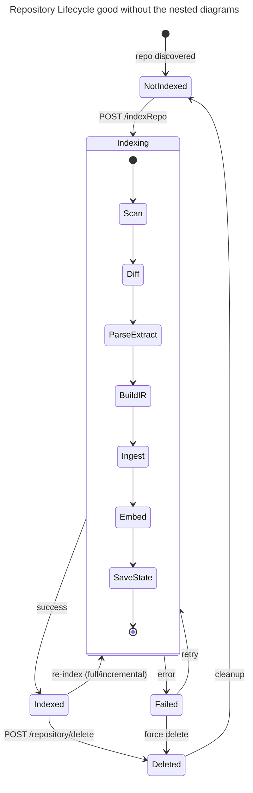
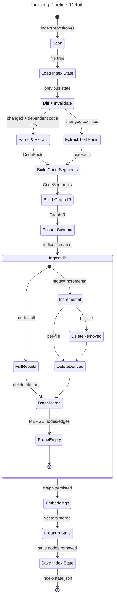
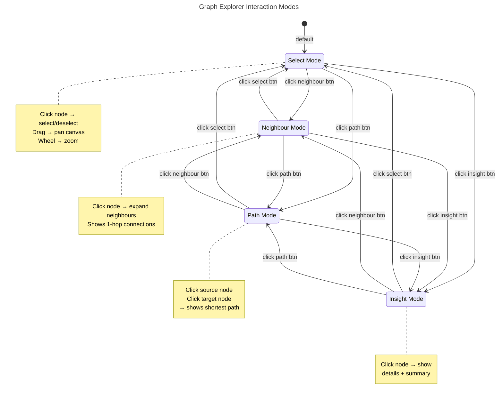
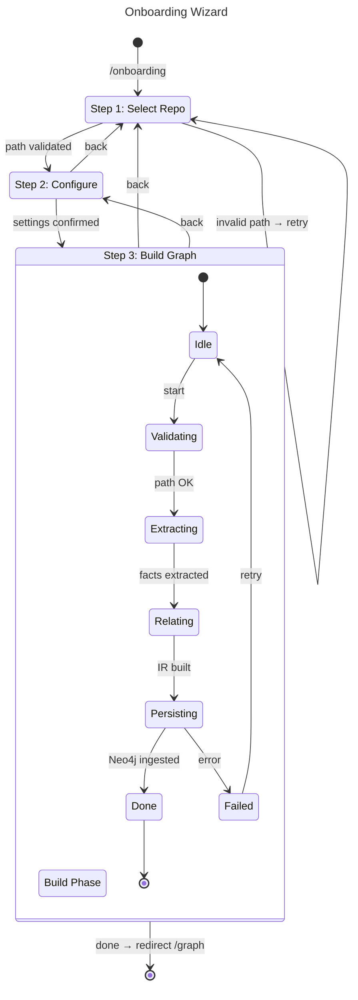
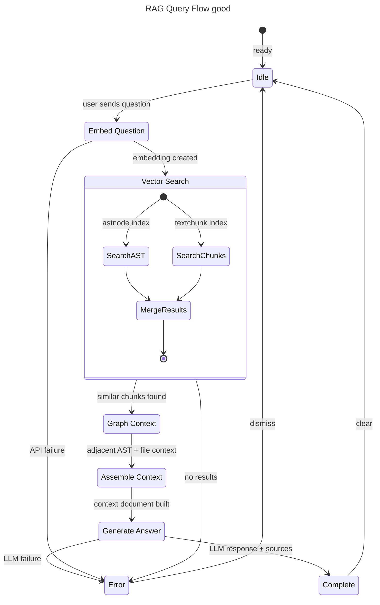
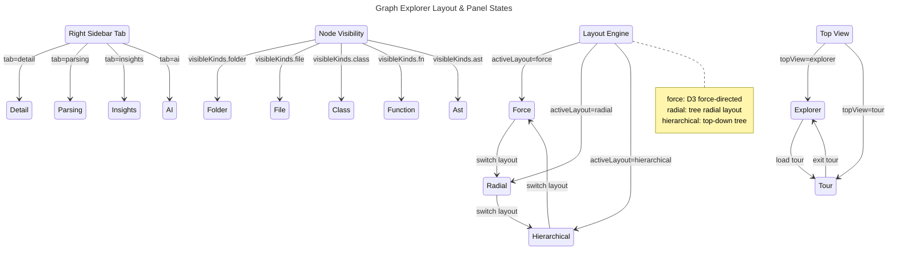
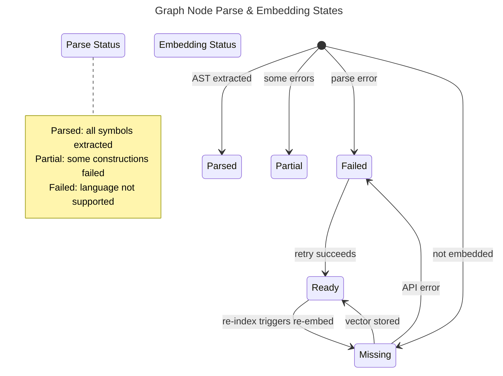

# CodeAtlas State Diagrams

```mermaid
---
title: Repository Lifecycle  good without the nested diagrams
---
stateDiagram-v2
    [*] --> NotIndexed: repo discovered
    NotIndexed --> Indexing: POST /indexRepo

    state Indexing {
        [*] --> Scan
        Scan --> Diff
        Diff --> ParseExtract
        ParseExtract --> BuildIR
        BuildIR --> Ingest
        Ingest --> Embed
        Embed --> SaveState
        SaveState --> [*]
    }

    Indexing --> Indexed: success
    Indexing --> Failed: error
    Failed --> Indexing: retry
    Indexed --> Indexing: re-index (full/incremental)
    Indexed --> Deleted: POST /repository/delete
    Deleted --> NotIndexed: cleanup
    Failed --> Deleted: force delete
```

---

```mermaid
---
title: Indexing Pipeline (Detail)
---
stateDiagram-v2
    state "Scan" as SCAN
    state "Load Index State" as LOAD
    state "Diff + Invalidate" as DIFF
    state "Parse & Extract" as PARSE
    state "Extract Text Facts" as TEXT
    state "Build Code Segments" as SEGMENT
    state "Build Graph IR" as IR
    state "Ensure Schema" as SCHEMA
    state "Ingest IR" as INGEST
    state "Embeddings" as EMBED
    state "Cleanup Stale" as CLEANUP
    state "Save Index State" as SAVE

    [*] --> SCAN: indexRepository()
    SCAN --> LOAD: file tree
    LOAD --> DIFF: previous state
    DIFF --> PARSE: changed + dependent code files
    DIFF --> TEXT: changed text files
    PARSE --> SEGMENT: CodeFacts
    TEXT --> SEGMENT: TextFacts
    SEGMENT --> IR: CodeSegments
    IR --> SCHEMA: GraphIR
    SCHEMA --> INGEST: indices created

    state INGEST {
        [*] --> FullRebuild: mode=full
        [*] --> Incremental: mode=incremental
        FullRebuild --> BatchMerge: delete old run
        Incremental --> DeleteRemoved: per-file
        Incremental --> DeleteDerived: per-file
        DeleteRemoved --> DeleteDerived
        DeleteDerived --> BatchMerge
        BatchMerge --> PruneEmpty: MERGE nodes/edges
        PruneEmpty --> [*]
    }

    INGEST --> EMBED: graph persisted
    EMBED --> CLEANUP: vectors stored
    CLEANUP --> SAVE: stale nodes removed
    SAVE --> [*]: index-state.json
```

---

```mermaid
---
title: Graph Explorer Interaction Modes
---
stateDiagram-v2
    state "Select Mode" as SELECT
    state "Neighbour Mode" as NEIGHBOUR
    state "Path Mode" as PATH
    state "Insight Mode" as INSIGHT

    [*] --> SELECT: default
    SELECT --> NEIGHBOUR: click neighbour btn
    SELECT --> PATH: click path btn
    SELECT --> INSIGHT: click insight btn
    NEIGHBOUR --> SELECT: click select btn
    NEIGHBOUR --> PATH: click path btn
    NEIGHBOUR --> INSIGHT: click insight btn
    PATH --> SELECT: click select btn
    PATH --> NEIGHBOUR: click neighbour btn
    PATH --> INSIGHT: click insight btn
    INSIGHT --> SELECT: click select btn
    INSIGHT --> NEIGHBOUR: click neighbour btn
    INSIGHT --> PATH: click path btn

    note right of SELECT
        Click node → select/deselect
        Drag → pan canvas
        Wheel → zoom
    end note

    note right of NEIGHBOUR
        Click node → expand neighbours
        Shows 1-hop connections
    end note

    note right of PATH
        Click source node
        Click target node
        → shows shortest path
    end note

    note right of INSIGHT
        Click node → show
        details + summary
    end note
```

---

```mermaid
---
title: Onboarding Wizard
---
stateDiagram-v2
    state "Step 1: Select Repo" as STEP1
    state "Step 2: Configure" as STEP2
    state "Step 3: Build Graph" as STEP3

    [*] --> STEP1: /onboarding
    STEP1 --> STEP2: path validated
    STEP1 --> STEP1: invalid path → retry
    STEP2 --> STEP3: settings confirmed

    state STEP3 {
        state "Build Phase" as BUILD_PHASE
        [*] --> Idle
        Idle --> Validating: start
        Validating --> Extracting: path OK
        Extracting --> Relating: facts extracted
        Relating --> Persisting: IR built
        Persisting --> Done: Neo4j ingested
        Persisting --> Failed: error
        Done --> [*]
        Failed --> Idle: retry
    }

    STEP3 --> [*]: done → redirect /graph
    STEP3 --> STEP1: back
    STEP3 --> STEP2: back
    STEP2 --> STEP1: back
```

---

```mermaid
---
title: RAG Query Flow  good
---
stateDiagram-v2
    state "Idle" as IDLE
    state "Embed Question" as EMBED_Q
    state "Vector Search" as VSEARCH
    state "Graph Context" as GCONTEXT
    state "Assemble Context" as ASSEMBLE
    state "Generate Answer" as GENERATE
    state "Complete" as DONE
    state "Error" as ERROR

    [*] --> IDLE: ready
    IDLE --> EMBED_Q: user sends question
    EMBED_Q --> VSEARCH: embedding created
    VSEARCH --> GCONTEXT: similar chunks found

    state VSEARCH {
        [*] --> SearchAST: astnode index
        [*] --> SearchChunks: textchunk index
        SearchAST --> MergeResults
        SearchChunks --> MergeResults
        MergeResults --> [*]
    }

    GCONTEXT --> ASSEMBLE: adjacent AST + file context
    ASSEMBLE --> GENERATE: context document built
    GENERATE --> DONE: LLM response + sources
    GENERATE --> ERROR: LLM failure
    VSEARCH --> ERROR: no results
    EMBED_Q --> ERROR: API failure
    DONE --> IDLE: clear
    ERROR --> IDLE: dismiss
```

---

```mermaid
---
title: Graph Explorer Layout & Panel States
---
stateDiagram-v2
    state "Layout Engine" as LAYOUT
    state "Right Sidebar Tab" as RTAB
    state "Top View" as TOPVIEW
    state "Node Visibility" as VIS

    LAYOUT --> Force: activeLayout=force
    LAYOUT --> Radial: activeLayout=radial
    LAYOUT --> Hierarchical: activeLayout=hierarchical

    Force --> Radial: switch layout
    Radial --> Hierarchical: switch layout
    Hierarchical --> Force: switch layout

    RTAB --> Detail: tab=detail
    RTAB --> Parsing: tab=parsing
    RTAB --> Insights: tab=insights
    RTAB --> AI: tab=ai

    TOPVIEW --> Explorer: topView=explorer
    TOPVIEW --> Tour: topView=tour
    Explorer --> Tour: load tour
    Tour --> Explorer: exit tour

    VIS --> Folder: visibleKinds.folder
    VIS --> File: visibleKinds.file
    VIS --> Class: visibleKinds.class
    VIS --> Function: visibleKinds.fn
    VIS --> Ast: visibleKinds.ast

    note right of LAYOUT
        force: D3 force-directed
        radial: tree radial layout
        hierarchical: top-down tree
    end note
```

---

```mermaid
---
title: Graph Node Parse & Embedding States
---
stateDiagram-v2
    state "Parse Status" as PARSE_ST
    state "Embedding Status" as EMBED_ST

    [*] --> Parsed: AST extracted
    [*] --> Partial: some errors
    [*] --> Failed: parse error

    [*] --> Missing: not embedded
    Missing --> Ready: vector stored
    Missing --> Failed: API error
    Ready --> Missing: re-index triggers re-embed
    Failed --> Ready: retry succeeds

    note right of PARSE_ST
        Parsed: all symbols extracted
        Partial: some constructions failed
        Failed: language not supported
    end note
```
