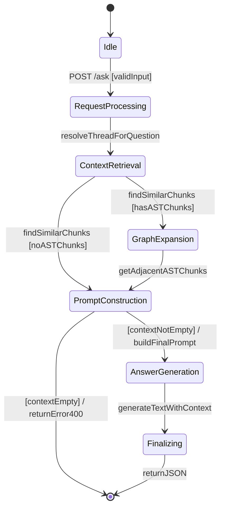
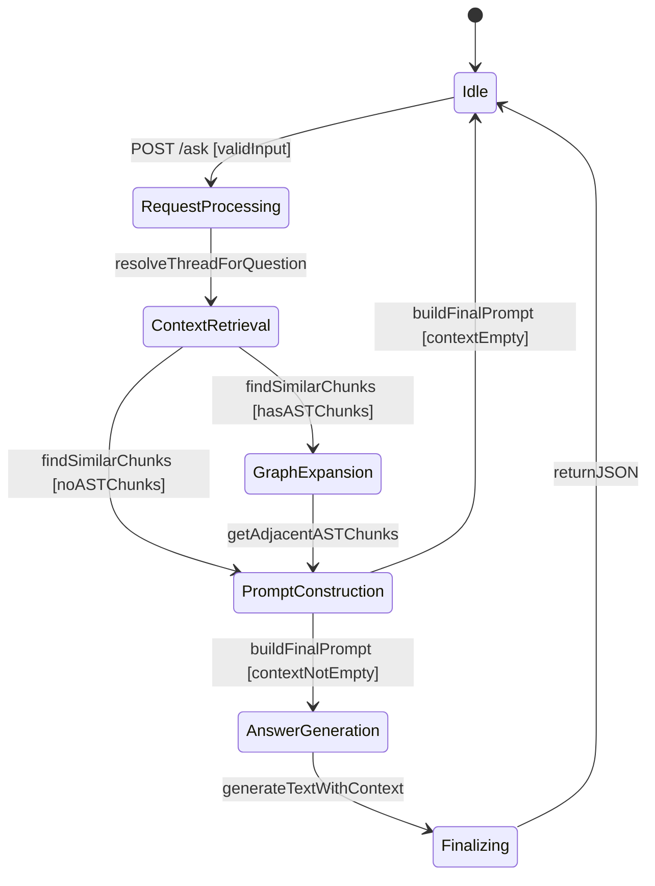

# GraphRAG Pipeline State Diagram

This diagram represents the flow of the GraphRAG pipeline from the initial user question to the final generated answer, based on the implementation in `apps/server/src/routes/graphrag.ts` and following the state diagram conventions defined in the project documentation.

## State Definitions

| State | Description |
|-------|-------------|
| **Idle** | System is waiting for an incoming request. |
| **RequestProcessing** | Initial validation of the request body and resolution of the chat thread. |
| **ContextRetrieval** | Generates embeddings for the question and retrieves relevant code chunks and node context from Neo4j. |
| **GraphExpansion** | Traverses the knowledge graph to find adjacent nodes and related code for retrieved AST chunks. |
| **PromptConstruction** | Merges all retrieved context (vector, graph, and summaries) into a formatted prompt for the LLM. |
| **AnswerGeneration** | Calls the LLM (via OpenRouter) to generate a grounded response based on the constructed prompt. |
| **Finalizing** | Appends the assistant's response and sources to the database thread and prepares the final response. |

## Transitions & Logic

- **POST /ask**: The trigger event starting the pipeline.
- **[hasASTChunks]**: Guard condition. If the vector search returns AST nodes, the pipeline attempts to expand the context via graph relationships.
- **[contextEmpty]**: If no relevant context is found, the system returns an error (400) and returns to Idle.
- **returnJSON**: The final action that sends the answer and sources back to the client.

old

