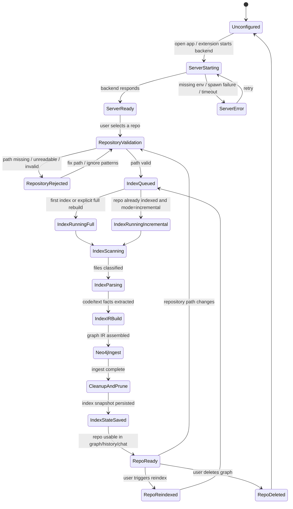
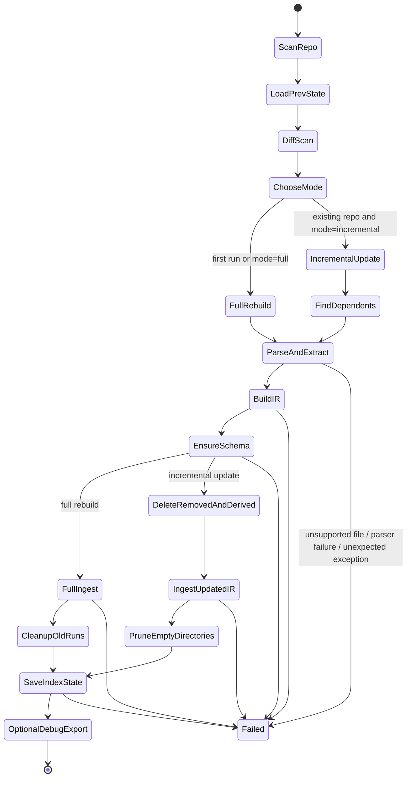
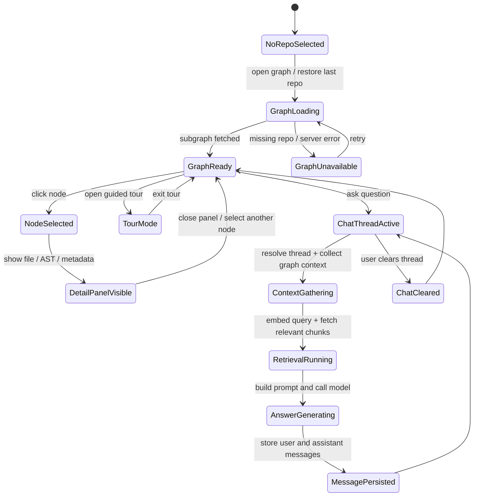
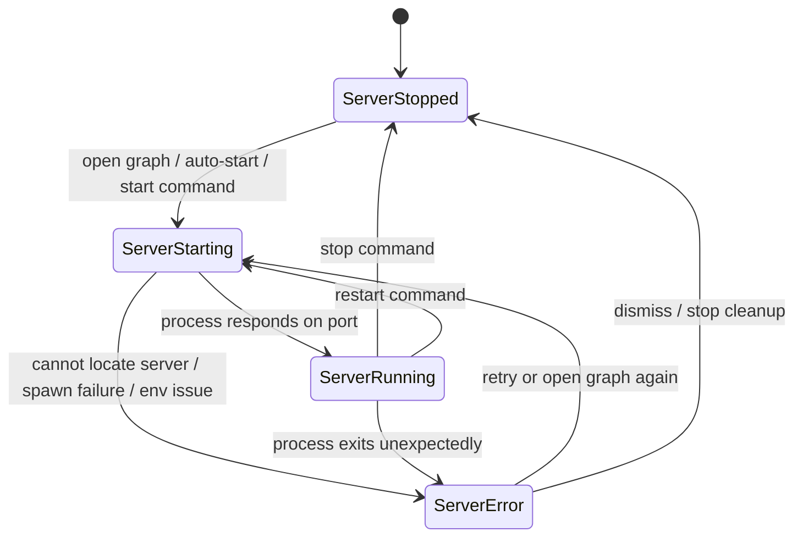

# CodeAtlas State Diagrams

These diagrams reflect the current project flow in the web app, server, and VS Code extension.

## 1) Repository lifecycle

## 2) Indexing pipeline

## 3) Graph exploration and chat

## 4) VS Code extension/server control

## Notes

- The repository lifecycle is the main business flow.
- The indexing pipeline is intentionally split out because it has its own internal failure and retry states.
- Graph exploration and chat are separate from indexing; they become available only after a repository has been indexed.
- The extension state is useful if you use CodeAtlas inside VS Code, since it controls backend startup and repo indexing entry points.
